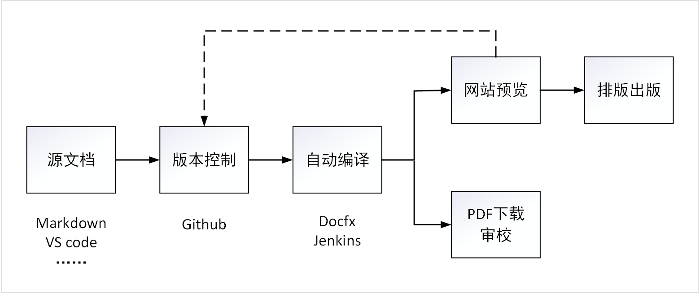

适合程序员协作文档创编的工作流
===

本工作流是适合程序员等技术人员进行写作的工作方式，可以方便地借助于Git、Markdown等工具和语言，编写逻辑复杂的文档，同时特别适合于文档内容中包含复杂的程序代码。

本工作流的特点
---

- 使用标准通用开源的格式和工具，不自行开发非标准的格式和功能。
- 使用程序员中流行的Markdown编写文档
- 不限定任何编辑工具或环境，编写者随意选择编辑工具
- 纯文本编辑，使用git来进行文档的管理及版本控制
- 多人协同创作，使用团队开发中相同的方式解决内容冲突
- 实时渲染出效果，供屏幕预览
- 实时渲染出PDF，供打印纸稿审阅
- 适配移动设备查看文档

基本结构
---

**图1** 本工作流的基本结构

基本操作方式
---

1. 从Github上克隆repo：`git clone https://github.com/artechcn/writing.git`。 
2. 使用任何作者习惯的文本编辑器撰写文档，推荐使用`VS Code`进行本文编辑，。
3. 使用VS Code的插件`docs-markdown`可以分幕预览效果。
3. 使用VS Code的插件GitLens，可以方便地使用git将写好的文档提交到git上，随时保持文档的版本控制。
4. 提交内容后，经过大约5分钟，就可以到 http://www.webstack.com.cn 看到效果。 
5. http://www.webstack.com.cn 已经适配移动端。
6. 可以随时链接到Github查看某部分内容对应的源文件，进行修改。

markdown语法
---

1. 本系统使用的是与GFM（Github风格Markdown）100%兼容的DFM，[基本语法参考这里](dfm_user_guide.md)。
2. DFM比GFM增加的特性参见<https://github.github.com/gfm/>。
3. 最终效果可以参考一个[包含三章内容的演示文档](../python/python-sdk-azure-overview.md)。

文档的组织方式
---

1. 每本书对应一个顶级文件夹
2. 每本书对应与页面顶部的一个菜单项目
3. 选中一个顶部菜单，就可以查看该书的内容。
4. 每本书的目录大纲显示在页面右侧。
5. 一本书的目录结构由一个目录文件，通常命名为 toc.yml 进行定义。
6. 详细的说明请参考

本工作流使用的工具及相应的网站
---

- VS Code <https://code.visualstudio.com/>
- Github <https://github.com/>
- Docfx <https://dotnet.github.io/docfx/>
- GFM <https://github.github.com/gfm/>
- DFM <https://dotnet.github.io/docfx/spec/-docfx_flavored_markdown.html>

