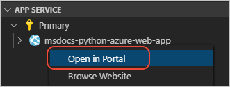
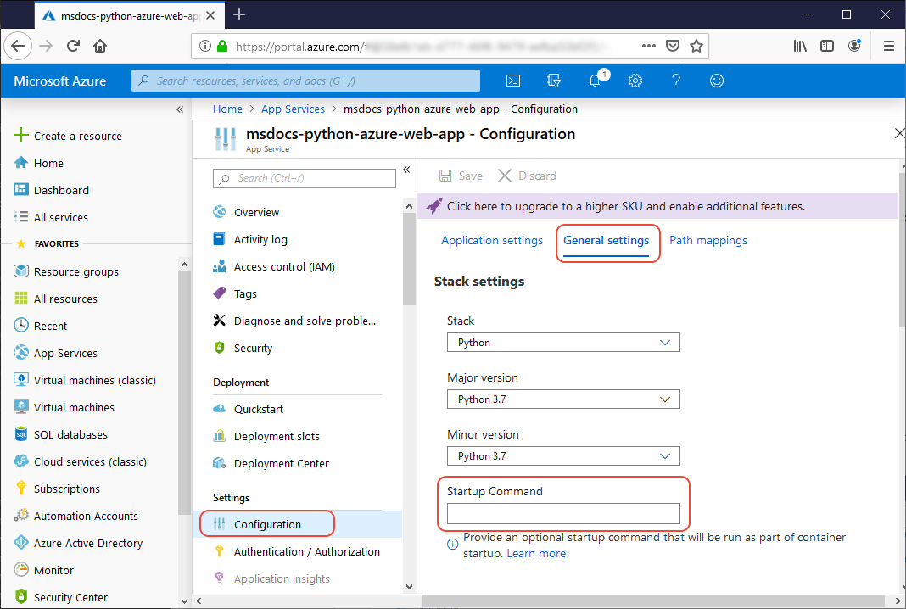

# <a name="tutorial-configure-a-custom-startup-file-for-python-apps-on-azure-app-service"></a>教程：在 Azure 应用服务上为 Python 应用配置自定义启动文件

[上一步：创建应用服务](tutorial-deploy-app-service-on-linux-02.md)

可能需要根据应用构建情况，按照 Azure 文档中[为 Linux 上的应用服务配置 Python 应用](https://docs.microsoft.com/azure/app-service/containers/how-to-configure-python)一文的说明为应用创建自定义启动命令文件。

自定义启动命令的具体用例如下：

- 你有一个 **Flask** 应用，其启动文件的名称不是  *application.py*，其应用对象的名称不是 `app`。 换言之，除非项目的根文件夹中存在 *application.py*，且  Flask 应用对象的名称为 `app`，否则就需要自定义启动命令。
- 需要使用默认参数（即 `--bind=0.0.0.0 --timeout 600`）之外的其他参数启动 Gunicorn Web 服务器。

## <a name="create-a-startup-file"></a>创建启动文件

如果需要一个自定义启动文件，请使用以下步骤：

1. 在项目中创建名为 *startup.txt*（或所选的其他名称）的文件，其中包含启动命令。 对于 Flask，请参阅下一部分的 [Flask 启动命令](#flask-startup-commands)。 Django 应用通常不需自定义。

1. 将文件提交到代码存储库，使之能够与应用的其余部分一起部署。

1. 在“Azure：函数”  应用服务”资源管理器中展开“应用服务”，右键单击“应用程序设置”，选择“在门户中打开”：  

    

1. 必要时，在 Azure 门户中登录；然后，在“配置”页上  选择“常规设置”，  在“堆栈设置”   >   “启动命令”下输入启动文件的名称（例如 *startup.txt*），然后选择“保存”。 

    

    > [!NOTE]
    > 也可将启动命令直接置于  Azure 门户的“启动命令”字段中，而不必使用启动命令文件。 但通常情况下，我们首选使用文件，因为这样可以将此类配置信息保存在存储库中，方便审核所做的更改，并将它们一起重新部署到另一应用服务实例。

1. 保存更改后，应用服务会重启。 但是，由于尚未部署应用代码，因此此时访问站点会显示“应用程序错误”。 此消息表明 Gunicorn 服务器已启动但找不到应用，因此没有对 HTTP 请求进行响应。 将在下一步部署应用代码。

## <a name="django-startup-commands"></a>Django 启动命令

默认情况下，应用服务会自动找到 *wsgi.py* 文件所在的文件夹，并通过以下命令启动 Gunicorn：

```bash
# <module> is the path to the folder that contains wsgi.py
gunicorn --bind=0.0.0.0 --timeout 600 <module>.wsgi
```

若要更改任何 Gunicorn 参数（例如使用 `--timeout 1200`），则请创建一个包含这些修改内容的命令文件。

## <a name="flask-startup-commands"></a>Flask 启动命令

默认情况下，Linux 容器中的应用服务假定 Flask 应用的启动文件名为 *application.py* 且驻留在应用的根文件夹中， 同时还假定在该文件中定义的 Flask 应用对象名为 `app`。 如果应用的结构不完全是这样，则自定义启动命令必须标识应用对象的位置：

1. **不同的文件名和/或应用对象名**：例如，如果应用的启动文件为 *hello.py* 且应用对象名为 `myapp`，则启动命令将如下所示：

    ```text
    gunicorn --bind=0.0.0.0 --timeout 600 hello:myapp
    ```

1. **启动文件位于子文件夹中**：例如，如果启动文件为 *myapp/website.py* 且应用对象为 `app`，则使用 Gunicorn 的 `--chdir` 参数指定文件夹，然后按通常方式为启动文件和应用对象命名：

    ```text
    gunicorn --bind=0.0.0.0 --timeout 600 --chdir myapp website:app
    ```

1. **启动文件位于模块中**：在 [python-sample-vscode-flask-tutorial](https://github.com/Microsoft/python-sample-vscode-flask-tutorial) 代码中，*webapp.py* 启动文件包含在文件夹 *hello_app* 中，该文件夹本身是一个包含 *\_\_init\_\_.py* 文件的模块。 应用对象名为 `app`，在 *\_\_init\_\_.py* 中定义。*webapp.py* 使用相对导入。 由于这种配置，将 Gunicorn 指向 `webapp:app` 会生成“尝试了以非程序包的形式进行相对导入”错误，应用无法启动。

    在这种情况下，请创建一个简单的可以从模块导入应用对象的填充程序文件，然后让 Gunicorn 使用该填充程序启动此应用。 例如，[python-sample-vscode-flask-tutorial](https://github.com/Microsoft/python-sample-vscode-flask-tutorial) 代码包含的 *startup.py* 具有以下内容：

    ```python
    # startup.py shim
    from hello_app.webapp import app
    ```

    启动命令如下：

    ```text
    gunicorn --bind=0.0.0.0 --timeout 600 startup:app
    ```

> [!div class="nextstepaction"]
> [我配置了我的启动文件](tutorial-deploy-app-service-on-linux-05.md)

[我遇到了问题](https://www.research.net/r/PWZWZ52?tutorial=vscode-appservice-python&step=04-startup-command)
