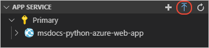
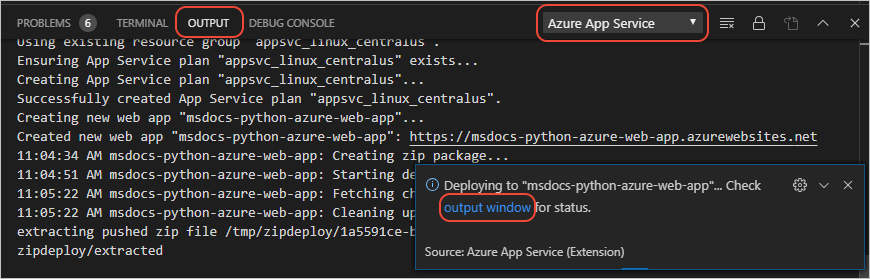
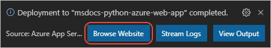
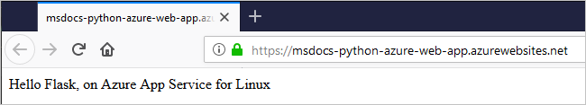
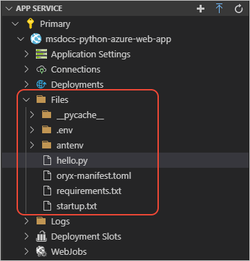

# 教程：将 Python Web 应用部署到 Linux 上的 Azure 应用服务

[上一步：配置自定义启动文件](tutorial-deploy-app-service-on-linux-04.md)

1. 在 Visual Studio Code 中打开“Azure:  应用服务”资源管理器，然后选择蓝色的向上箭头：

   

    也可右键单击应用服务名称，然后选择“部署到 Web 应用”命令。 

1. 在随后的提示窗口中，提供以下详细信息：

    - 对于“选择要部署的文件夹”选项，请选择当前的应用文件夹。
    - 对于“选择 Web 应用”选项，请选择在上一步创建的应用服务。

1. 部署过程正在进行时，可以在 VS Code 的“输出”窗口中查看进度。 

    

1. 如果部署在数分钟（具体取决于多少依赖项需要安装）后完成，则会显示以下消息。 选择“浏览网站”按钮，查看正在运行的站点。 

    

    

1. 若要验证文件是否已部署，请在“Azure:  应用服务”资源管理器中展开应用服务，然后展开“文件”： 

    

    *antenv* 文件夹是应用服务创建包含依赖项的虚拟环境的位置。 如果展开此节点，则可验证在 *requirements.txt* 中命名的包是否安装在 *antenv/lib/python3.7/site-packages* 中。

> [!div class="nextstepaction"]
> [我部署了我的应用](tutorial-deploy-app-service-on-linux-06.md)

[我遇到了问题](https://www.research.net/r/PWZWZ52?tutorial=vscode-appservice-python&step=05-deploy-app)
