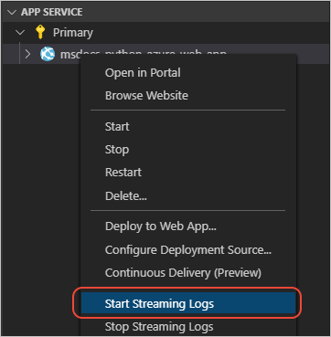

# 教程：将日志从 Azure 应用服务流式传输到 Visual Studio Code 中

[上一步：部署应用](tutorial-deploy-app-service-on-linux-05.md)

1. 在 Visual Studio Code 中打开“Azure:  应用服务”资源管理器，右键单击应用服务，然后选择“开始流式传输日志”： 

   

1. 当系统提示你启用文件日志记录功能并重启 Web 应用时，请选择“是”。  当应用重启时，  VS Code 中的“输出”窗口会显示进度。 启用日志记录是一次性的操作。

1. 启用日志记录后，请右键单击应用服务，然后再次选择“开始流式传输日志”。   VS Code 中的“输出”窗口会显示“正在启动实时日志流”，日志输出开始显示。 尝试在浏览器中刷新 Web 应用可生成更多日志信息。

1. 若要停止流式传输日志（不禁用日志记录），请在“Azure:  应用服务”资源管理器中右键单击应用，然后选择“停止流式传输日志”。 

> [!div class="nextstepaction"]
> [我看到了日志](tutorial-deploy-app-service-on-linux-07.md)

[我遇到了问题](https://www.research.net/r/PWZWZ52?tutorial=vscode-appservice-python&step=06-stream-logs)
