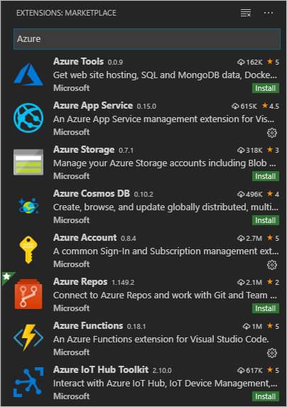

# 教程：在从 Visual Studio Code 部署到 Linux 上的 Azure 应用服务后清理资源

[上一步：流式传输日志](tutorial-deploy-app-service-on-linux-06.md)

创建的应用服务包含一项可能产生费用的后备应用服务计划。 若要清理资源，请在“Azure:  应用服务”资源管理器中右键单击应用服务，然后选择“删除”。 

也可访问 [Azure 门户](https://portal.azure.com)，从左侧导航窗格中选择“资源组”，  接着选择在本教程中创建的资源组，然后使用“删除资源组”命令。 

## 后续步骤

恭喜，你已完成了本演练，已经将 Python 代码部署到 Linux 上的应用服务！

如前所述，若要详细了解应用服务扩展，可以访问其 GitHub 存储库：[vscode-azureappservice](https://github.com/Microsoft/vscode-azureappservice)。 欢迎提交问题和贡献材料。

若要详细了解可以通过 Python 使用的 Azure 服务（包括数据存储、AI 和机器学习服务），请访问 [Azure Python 开发人员中心](https://docs.microsoft.com/python/azure/?view=azure-python)。

可能还有其他用于 VS Code 的 Azure 扩展对你有用。 直接在“扩展”资源管理器中搜索“Azure”：

下面是一些常用的扩展：

- [Cosmos DB](https://marketplace.visualstudio.com/items?itemName=ms-azuretools.vscode-cosmosdb)
- [Azure Functions](https://marketplace.visualstudio.com/items?itemName=ms-azuretools.vscode-azurefunctions)
- [Azure CLI 工具](https://marketplace.visualstudio.com/items?itemName=ms-vscode.azurecli)
- [Azure 资源管理器 (ARM) 工具](https://marketplace.visualstudio.com/items?itemName=msazurermtools.azurerm-vscode-tools)

> [!div class="nextstepaction"]
> [我完成了](https://docs.microsoft.com/python/azure/?view=azure-python) 

[我遇到了问题](https://www.research.net/r/PWZWZ52?tutorial=vscode-appservice-python&step=07-clean-up-resources)
