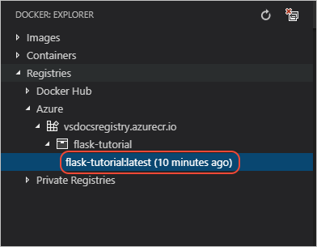
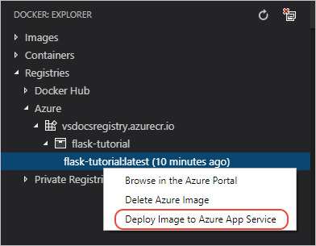
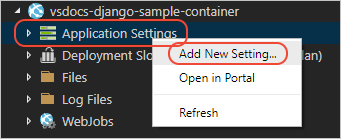

# 教程：将容器映像部署到 Azure 应用服务

[上一步：先决条件](tutorial-deploy-containers-01.md)

容器映像位于注册表中以后，即可使用 VS Code 中的 Docker 扩展轻松地设置一项运行该容器的 Azure 应用服务。

1. 在 **Docker** 资源管理器中，依次展开“注册表”、  注册表的节点（例如 **Azure**）、映像名称的节点，直到看到带 `:latest` 标记的映像。

    

1. 右键单击映像，然后选择“将映像部署到 Azure 应用服务”  。

    

1. 按照提示操作，选择 Azure 订阅，选择或指定资源组，指定区域，配置“应用服务计划”（B1 是开销最小的），然后指定站点的名称。 下面的动画演示了该过程。

    

    “资源组”  是组成某个应用的不同资源的命名集合。 将应用的所有资源分配给单个组即可轻松地以单个单元的形式管理这些资源。 （有关详细信息，请参阅 Azure 文档中的 [Azure 资源管理器概述](https://docs.microsoft.com/azure/azure-resource-manager/resource-group-overview)。）

    应用服务计划  定义那些托管运行的容器的物理资源（底层虚拟机）。 就本教程来说，B1 是支持 Docker 容器的开销最小的计划。 （有关详细信息，请参阅 Azure 文档中的[应用服务计划概述](https://docs.microsoft.com/azure/app-service/azure-web-sites-web-hosting-plans-in-depth-overview)。）

    应用服务的名称必须在整个 Azure 中独一无二，因此通常使用公司或个人名称。 对于生产站点，我们通常使用单独注册的域名来配置应用服务。

1. 创建应用服务需要数分钟，可以在 VS Code 的“输出”面板中查看进度。

1. 完成后，还必须  将名为 `WEBSITES_PORT`（注意复数形式的“WEBSITES”）的设置添加到应用服务，以便指定供容器在其上侦听的端口。 （例如，如果使用[在 VS Code 中创建 Python 容器](https://code.visualstudio.com/docs/python/tutorial-create-container)教程中的映像，则用于 Flask 的端口为 5000，用于 Django 的端口为 8000）。 若要设置 `WEBSITES_PORT`，请切换到“Azure:  应用服务”资源管理器，展开新应用服务的节点（必要时进行刷新），然后右键单击“应用程序设置”  并选择“添加新设置”。  出现提示时，输入 `WEBSITES_PORT` 作为键，输入端口号作为值。

    

1. 更改设置后，应用服务会自动重启。 也可随时右键单击应用服务，然后选择“重启”。 

1. 在服务重启后，通过 `http://<name>.azurewebsites.net` 浏览站点。 可以通过 **Ctrl**+ 单击（在 macOS 上为 **Cmd** + 单击）来访问“输出”面板中的 URL，也可以右键单击“Azure:  应用服务”资源管理器中的应用服务，然后选择“浏览网站”。 

> [!div class="nextstepaction"]
> [我部署了映像](tutorial-deploy-containers-03.md)

[我遇到了问题](https://www.research.net/r/PWZWZ52?tutorial=vscode-appservice-containers&step=02-deploy-container)
