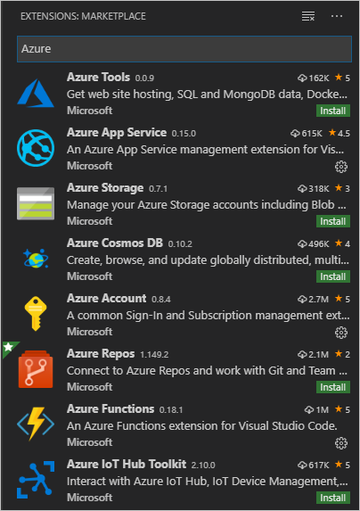

# 教程：清理 Azure 资源

在本教程中创建的各种 Azure 资源可能会持续产生费用。 若要清理它们，最好是访问 [Azure 门户](https://portal.azure.com)，从左侧导航窗格中选择“资源组”，  接着选择在本教程中创建的资源组，然后使用“删除资源组”命令。 

## 后续步骤

若要详细了解 Docker 和应用服务扩展，可以访问它们各自在 GitHub 上的存储库：[vscode-docker](https://github.com/Microsoft/vscode-docker) 和 [vscode-azureappservice](https://github.com/Microsoft/vscode-azureappservice)。 欢迎提交问题和贡献材料。

若要详细了解可以通过 Python 使用的 Azure 服务（包括数据存储、AI 和机器学习服务），请访问 [Azure Python 开发人员中心](https://docs.microsoft.com/python/azure/?view=azure-python)。

可能还有其他用于 VS Code 的 Azure 扩展对你有用。 直接在“扩展”资源管理器中搜索“Azure”：

下面是一些常用的扩展：

- [Cosmos DB](https://marketplace.visualstudio.com/items?itemName=ms-azuretools.vscode-cosmosdb)
- [Azure Functions](https://marketplace.visualstudio.com/items?itemName=ms-azuretools.vscode-azurefunctions)
- [Azure CLI 工具](https://marketplace.visualstudio.com/items?itemName=ms-vscode.azurecli)
- [Azure 资源管理器 (ARM) 工具](https://marketplace.visualstudio.com/items?itemName=msazurermtools.azurerm-vscode-tools)

> [!div class="nextstepaction"]
> [我完成了](https://docs.microsoft.com/python/azure/?view=azure-python)

[我遇到了问题](https://www.research.net/r/PWZWZ52?tutorial=vscode-appservice-containers&step=07-clean-up-resources)
