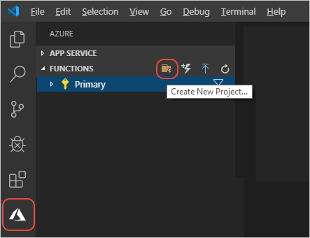
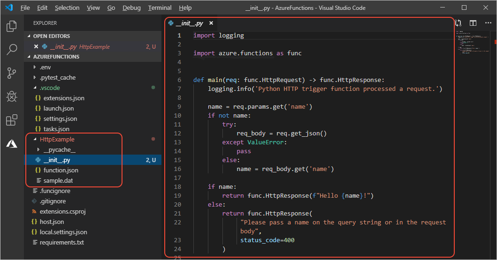
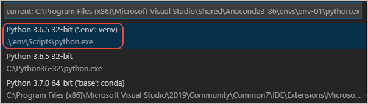
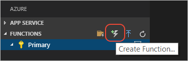

# 教程：为 Azure Functions 创建 Python 函数

[上一步：先决条件](tutorial-vs-code-serverless-python-01.md)

1. Azure Functions 的代码在 Functions  项目中管理，该项目在创建代码之前创建。 在 **Azure:Functions** 资源管理器（已使用左侧的 Azure 图标打开）中选择“新建项目”命令图标，  或者打开命令面板 (F1) 并选择“Azure Functions:  Create New Project”。

    

1. 在接下来的提示窗口中执行以下操作：

    | Prompt | 值 | 说明 |
    | --- | --- | --- |
    | 为项目指定文件夹 | 当前打开的文件夹 | 可在其中创建项目的文件夹。 可能需要在子文件夹中创建项目。 |
    | 选择函数应用项目的语言 | **Python** | 用于函数的语言，决定了用于代码的模板。 |
    | 为项目的第一个函数选择模板 | **HTTP 触发器** | 向函数的终结点发出 HTTP 请求时，系统就会运行一个使用 HTTP 触发器的函数。 （有各种用于 Azure Functions 的其他触发器。 若要了解详细信息，请参阅[使用 Functions 可以做什么？](/azure/azure-functions/functions-overview#what-can-i-do-with-functions)。） |
    | 提供函数名称 | HttpExample | 此名称用于一个子文件夹，该文件夹包含函数的代码和配置数据，并且还定义 HTTP 终结点的名称。 请使用“HttpExample”而不是接受默认的“HTTPTrigger”，这样可以将函数本身与触发器区别开来。 |
    | 授权级别 | **匿名** | 匿名授权使得该函数可供任何人公开访问。 |
    | 选择打开项目的方式 | **在当前窗口中打开** | 在当前的 Visual Studio Code 窗口中打开项目。 |

1. 稍后会出现一条表明新项目已创建的消息。 在**资源管理器**中有针对该函数创建的子文件夹，Visual Studio Code 会打开 *\_\_init\_\_.py* 文件，其中包含默认的函数代码：

    

    > [!NOTE]
    > 如果 Visual Studio Code 在打开 *\_\_init\_\_.py* 时告知你，你没有选择 Python 解释器，请打开命令面板 (**F1**)，选择“Python:  选择解释器”命令，然后在本地 `.env` 文件夹（已创建为项目的一部分）中选择虚拟环境。 具体说来，环境必须基于 Python 3.6x，这在上一篇文章的[先决条件](tutorial-vs-code-serverless-python-01.md#prerequisites)中已注明。
    >
    > 

> [!TIP]
> 如果需要在同一项目中创建另一函数，请使用  **Azure:Functions** 资源管理器中的“创建函数”命令，或者打开命令面板 (**F1**) 并选择“Azure Functions:  Create Function”命令。 两个命令都会提示你输入函数名称（即终结点的名称），然后创建一个包含默认文件的子文件夹。
>
> 

> [!div class="nextstepaction"]
> [我创建了函数](tutorial-vs-code-serverless-python-03.md)

[我遇到了问题](https://www.research.net/r/PWZWZ52?tutorial=vscode-functions-python&step=02-create-function)
