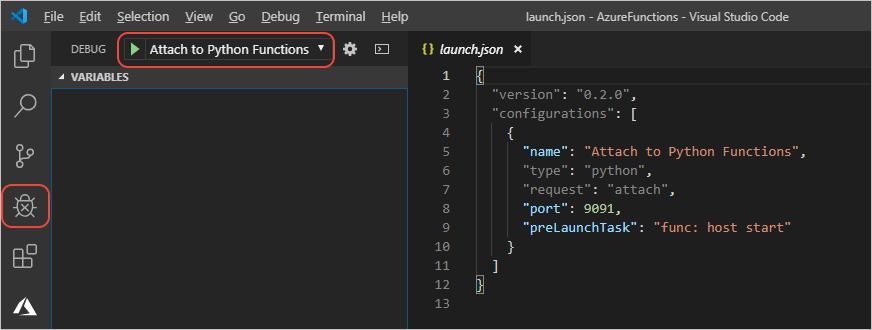

# <a name="tutorial-debug-the-azure-functions-python-code-locally"></a>教程：在本地调试 Azure Functions Python 代码

[上一步：检查代码文件](tutorial-vs-code-serverless-python-03.md)

1. 创建 Functions 项目时，Visual Studio Code 扩展也在 `.vscode/launch.json` 中创建启动配置，该文件包含名为“附加到 Python 含”的单个配置。  此配置意味着，若要启动项目，只需按 F5 或使用调试资源管理器：

    

1. 启动调试程序时，会打开一个终端，显示来自 Azure Functions 的输出，其中包含可用终结点的摘要。 如果使用的名称不是“HttpExample”，则 URL 可能有所不同：

    ```output
    Http Functions:

            HttpExample: [GET,POST] http://localhost:7071/api/HttpExample
    ```

1. 在 Visual Studio Code 的“输出”窗口  中对 URL 使用 **Ctrl+单击**或 **Cmd+单击** 即可将浏览器打开到该地址，也可启动浏览器后在其中粘贴同一 URL。 不管什么情况，终结点都是 `api/<function_name>`，在此示例中为 `api/HttpExample`。 但是，由于该 URL 不含名称参数，因此浏览器窗口会直接显示“请传递查询字符串或请求正文中的名称”，此名称与代码中的该路径相对应。

1. 现在，请尝试添加一个要使用的名称参数，例如 `http://localhost:7071/api/HttpExample?name=VS%20Code`，然后浏览器窗口会显示“Hello Visual Studio Code!”消息，表示你已运行该代码路径。

1. 若要在 JSON 请求正文中传递名称值，可以使用 curl 之类的内联了 JSON 的工具：

    ```bash
    # Mac OS/Linux: modify the URL if you're using a different function name
    curl --header "Content-Type: application/json" --request POST \
        --data {"name":"Visual Studio Code"} http://localhost:7071/api/HttpExample
    ```

    ```ps
    # Windows (escaping on the quotes is necessary; also modify the URL
    # if you're using a different function name)
    curl --header "Content-Type: application/json" --request POST \
        --data {"""name""":"""Visual Studio Code"""} http://localhost:7071/api/HttpExample
    ```

    也可创建 *data.json* 之类的包含 `{"name":"Visual Studio Code"}` 的文件，并使用 `curl --header "Content-Type: application/json" --request POST --data @data.json http://localhost:7071/api/HttpExample` 命令。

1. 若要对函数调试功能进行测试，请在行中设置一个断点 (`name = req.params.get('name')`)，然后再次向该 URL 发出请求。 Visual Studio Code 调试程序会在该行中暂停，让你可以检查变量并对代码进行步进调试。 （若要快速了解基本的调试，请参阅 [Visual Studio Code 教程 - 配置和运行调试程序](https://code.visualstudio.com/docs/python/python-tutorial#configure-and-run-the-debugger)。）

1. 如果已在本地对函数进行详细的测试并对测试结果满意，请停止调试程序（使用“调试”   >   “停止调试”菜单命令，或者使用调试工具栏上的“断开连接”命令  ）。

> [!div class="nextstepaction"]
> [我在本地运行了调试程序](tutorial-vs-code-serverless-python-05.md)

[我遇到了问题](https://www.research.net/r/PWZWZ52?tutorial=vscode-functions-python&step=04-test-debug)
