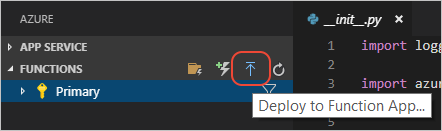
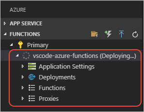
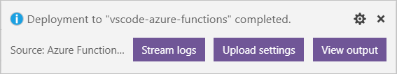

# <a name="tutorial-deploy-azure-functions-in-python"></a>教程：在 Python 中部署 Azure Functions

[上一步：本地调试](tutorial-vs-code-serverless-python-04.md)

在以下步骤中，我们使用 Functions 扩展在 Azure 中创建一个函数应用以及其他必需的 Azure 资源。 函数应用可将函数分组为一个逻辑单元，以便更轻松地管理、部署和共享资源。 它还需要一个用于数据的 Azure 存储帐户，以及一项[托管计划](/azure/azure-functions/functions-scale#hosting-plan-support)。 所有这些资源都被组织到单个资源组中。

1. 在“Azure：函数”  Functions”资源管理器中选择“部署到函数应用”命令，  或者打开命令面板 (**F1**)，然后选择“Azure Functions:  部署到函数应用”命令。 同样，函数应用是 Python 项目在 Azure 中运行时所在的位置。

    

1. 系统提示时，选择“在 Azure 中创建新的函数应用”，  提供在 Azure 中独一无二的名称（通常使用个人或公司名称以及其他唯一标识符；可以使用字母、数字和连字符）。 如果以前创建过函数应用，其名称会显示在此选项列表中。

1. 此扩展执行以下操作，这些操作可以在 Visual Studio Code 弹出消息和“输出”窗口中观察到（此过程需要数分钟）： 

    - 使用你提供的名称创建资源组（删除连字符）。
    - 在该资源组中，创建存储帐户、托管计划和函数应用。 默认情况下，会创建[消耗计划](/azure/azure-functions/functions-scale#consumption-plan)。 若要在专用计划中运行函数，需[启用通过高级创建选项进行发布的功能](/azure/azure-functions/functions-develop-vs-code)。
    - 将代码部署到函数应用。

    “Azure:  Functions”资源管理器也显示进度：

    

1. 部署完成后，Azure Functions 扩展会显示一条消息，其中包含用于三项其他操作的按钮：

    

    对于“流式传输日志”和“上传设置”，请参阅后续部分。   对于“查看输出”，请参阅后面的步骤 5。 

1. 部署后，“输出”  窗口还会显示 Azure 上的公共终结点：

    ```output
    HTTP Trigger Urls:
      HttpExample: https://vscode-azure-functions.azurewebsites.net/api/HttpExample
    ```

    使用此终结点运行已在本地运行的相同测试，将 URL 参数和/或请求与请求正文中的 JSON 数据配合使用。 公共终结点的结果应该与以前在[第 4 部分](tutorial-vs-code-serverless-python-04.md)测试的本地终结点的结果相符。

## <a name="stream-logs"></a>流式传输日志

针对日志流式传输的支持功能目前处于开发阶段，详见 Azure Functions 扩展的[问题 589](https://github.com/microsoft/vscode-azurefunctions/issues/589)。 部署弹出消息中的“流式传输日志”按钮  最终会将 Azure 上的日志输出连接到 Visual Studio Code。 也可在 **Azure Functions** 资源管理器上启动和停止日志流，方法是：右键单击 Functions 项目，然后选择“启动流式处理日志”或“停止流式处理日志”。  

但是，这些命令目前尚不可操作。 可以改在浏览器中使用日志流式传输，方法是：运行以下命令，将 `<app_name>` 替换为你在 Azure 上的 Functions 应用的名称：

```bash
# Replace <app_name> with the name of your Functions app on Azure
func azure functionapp logstream <app_name> --browser
```

## <a name="sync-local-settings-to-azure"></a>将本地设置同步到 Azure

部署弹出消息中的“上传设置”按钮  会将你对 *local.settings.json* 文件所做的任何更改应用到 Azure。 也可调用 **Azure Functions** 资源管理器上的命令，方法是：展开 Functions 项目节点，右键单击“应用程序设置”，然后选择“上传本地设置”。   还可以使用命令面板来选择“Azure Functions:  上传本地设置”命令。

上传设置可以更新任何现有的设置并添加在 *local.settings.json* 中定义的任何新设置。 上传操作不会删除未在本地文件中列出的任何来自 Azure 的设置。 若要删除那些设置，请在 **Azure Functions** 资源管理器中展开“应用程序设置”节点，右键单击设置，然后选择“删除设置”。   也可直接在 Azure 门户中编辑设置。

若要通过门户或 **Azure 资源管理器**应用对 *local.settings.json* 文件所做的更改，请右键单击“应用程序设置”节点，然后选择“下载远程设置”命令。   还可以使用命令面板来选择“Azure Functions:  下载远程设置”命令。

> [!div class="nextstepaction"]
> [我部署了函数](tutorial-vs-code-serverless-python-06.md)

[我遇到了问题](https://www.research.net/r/PWZWZ52?tutorial=vscode-functions-python&step=05-deploy)
