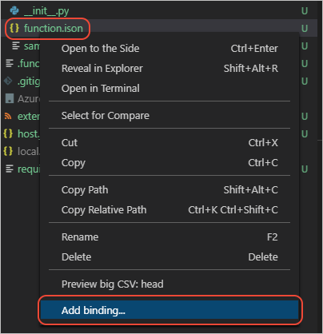

# <a name="tutorial-add-a-storage-binding-for-azure-functions-in-python"></a>教程：在 Python 中添加 Azure Functions 的存储绑定

[上一步：部署另一个函数](tutorial-vs-code-serverless-python-06.md)

可以通过绑定  将函数代码连接到资源（例如 Azure 存储），不需编写任何数据访问代码。 绑定在 *function.json* 文件中定义，可以代表输入和输出。 一个函数可以使用多个输入和输出绑定，但只能使用一个触发器。 有关详细信息，请参阅 [Azure Functions 触发器和绑定的概念](/azure/azure-functions/functions-triggers-bindings)。

在此部分，我们将存储绑定添加到此前在本教程中创建的 HttpExample 函数。 每次进行请求时，该函数通过此绑定将消息写入存储。 相关存储使用函数应用所使用的默认存储帐户。 但是，如果你打算大量使用存储，则需考虑创建单独的帐户。

1. 将 Azure Functions 项目的远程设置同步到 *local.settings.json* 文件中，方法是：打开命令面板，然后选择“Azure Functions:  下载远程设置”。 打开 *local.settings.json*，检查其中是否包含 `AzureWebJobsStorage` 的值。 该值是存储帐户的连接字符串。

1. 在 `HttpExample` 文件夹中，右键单击 *function.json*，选择“添加绑定”： 

    

1. 在 Visual Studio Code 的接下来的提示窗口中，选择或提供以下值：

    | Prompt | 要提供的值 |
    | --- | --- |
    | 设置绑定方向 | out |
    | 选择方向为 out 的绑定 | Azure Queue Storage |
    | 用于在代码中标识此绑定的名称 | msg |
    | 要向其发送消息的队列 | outqueue |
    | 从 *local.settings.json* 中选择设置（请求存储连接） | AzureWebJobsStorage |

1. 进行这些选择以后，验证以下绑定是否已添加到 *function.json* 文件：

    ```json
        {
          "type": "queue",
          "direction": "out",
          "name": "msg",
          "queueName": "outqueue",
          "connection": "AzureWebJobsStorage"
        }
    ```

1. 配置绑定以后，即可在函数代码中使用它。 同样，新定义的绑定在代码中显示为 *\_\_init\_\_.py* 中 `main` 函数的参数。 例如，可以根据以下内容修改 HttpExample 中的 *\_\_init\_\_.py* 文件，该文件演示如何使用 `msg` 参数来写入其名称在请求中使用的带时间戳的消息。 注释对具体的更改进行了说明：

    ```python
    import logging
    import datetime  # MODIFICATION: added import
    import azure.functions as func

    # MODIFICATION: the added binding appears as an argument; func.Out[func.QueueMessage]
    # is the appropriate type for an output binding with "type": "queue" (in function.json).
    def main(req: func.HttpRequest, msg: func.Out[func.QueueMessage]) -> func.HttpResponse:
        logging.info('Python HTTP trigger function processed a request.')

        name = req.params.get('name')
        if not name:
            try:
                req_body = req.get_json()
            except ValueError:
                pass
            else:
                name = req_body.get('name')

        if name:
            # MODIFICATION: write the a message to the message queue, using msg.set
            msg.set(f"Request made for {name} at {datetime.datetime.now()}")

            return func.HttpResponse(f"Hello {name}!")
        else:
            return func.HttpResponse(
                 "Please pass a name on the query string or in the request body",
                 status_code=400
            )
    ```

1. 若要在本地测试这些更改，请在 Visual Studio Code 中再次启动调试程序，方法是：按 F5 或选择“调试”   >   “启动调试”菜单命令。 与以前一样，“输出”窗口会显示项目中的终结点。 

1. 在浏览器中访问 URL `http://localhost:7071/api/HttpExample?name=VS%20Code`，以便创建一项针对 HttpExample 终结点的请求，这也会将消息写入队列。

1. 若要验证此消息是否已写入“outqueue”队列（在绑定中命名），可以使用以下三种方法之一：

    1. 登录 [Azure 门户](https://portal.azure.com)，导航到包含 Functions 项目的资源组。 在该资源组中找到项目的存储帐户并导航到其中，然后导航到“队列”中。  在该页上导航到“outqueue”中，此时会显示所有记录的消息。

    1. 通过集成了 Visual Studio 的 Azure 存储资源管理器导航并检查此队列，详见[使用 Visual Studio Code 将 Functions 连接到 Azure 存储](/azure/azure-functions/functions-add-output-binding-storage-queue-vs-code)，尤其是[检查输出队列](/azure/azure-functions/functions-add-output-binding-storage-queue-vs-code#examine-the-output-queue)部分。

    1. 使用 Azure CLI 查询存储队列，详见[查询存储队列](/azure/azure-functions/functions-add-output-binding-storage-queue-python#query-the-storage-queue)。

1. 若要在云中进行测试，请使用  **Azure:Functions** 资源管理器中的“部署到函数应用”命令重新部署代码。 当系统提示时，请选择以前创建的函数应用。 部署完成（需要数分钟！）后，“输出”窗口会再次显示可以用来重复你的测试的公共终结点。 

> [!div class="nextstepaction"]
> [我添加了存储绑定](tutorial-vs-code-serverless-python-08.md)

[我遇到了问题](https://www.research.net/r/PWZWZ52?tutorial=python-functions-extension&step=07-storage-binding)
